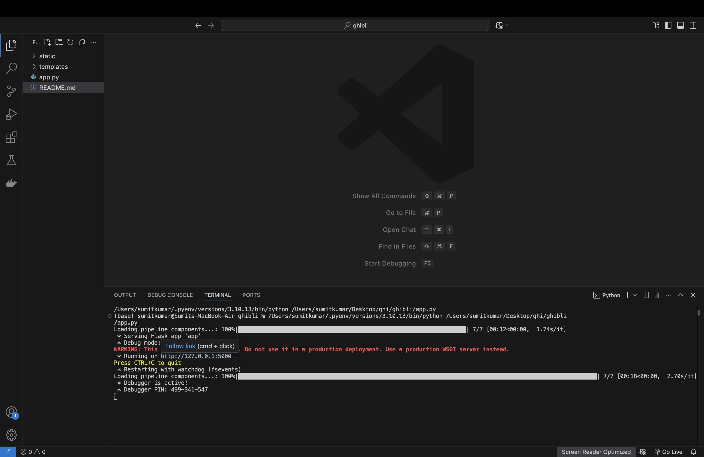
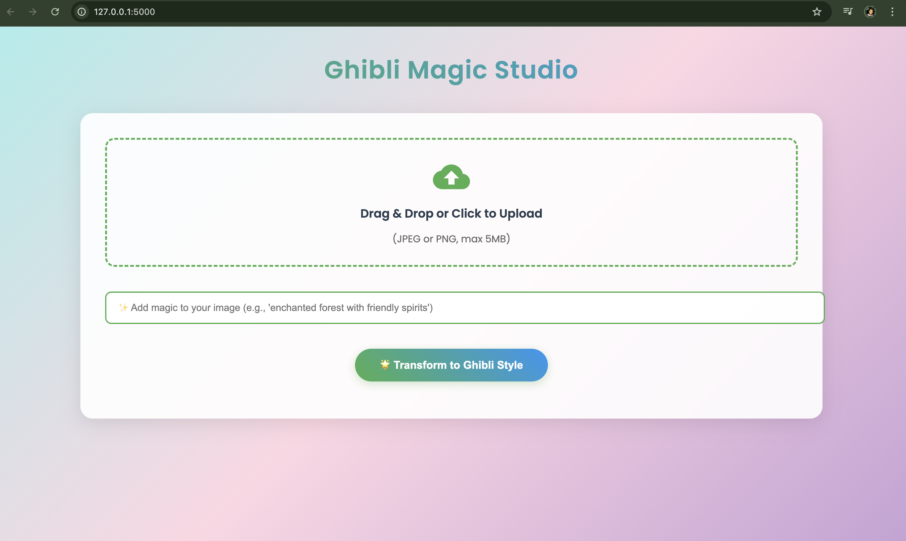

# 🎨 Image to Ghibli Style Converter

[](https://python.org)

[](https://flask.palletsprojects.com/)
[](https://huggingface.co)

Transform ordinary photos into magical Studio Ghibli-style artwork using AI! ✨





*Example transformation - Your Image ➔ Ghibli Masterpiece*

## 🌟 Features

- 🖼️ Upload any JPG/PNG image
- 🎨 Automatic Ghibli-style transformation
- 🕰️ Processing in 1-3 minutes (depending on hardware)
- 📸 Side-by-side comparison view
- 🖥️ Web-based interface
- 🍎 Optimized for Apple Silicon (M1/M2)

## 🚀 Quick Start

### Prerequisites
- Python 3.8+
- 8GB+ RAM (16GB recommended)
- 5GB free disk space

### Installation
```bash
# Clone the repository
git clone <Git colon link>
cd ghibli-converter

# Install dependencies
pip install -r requirements.txt# ghibli-converter
